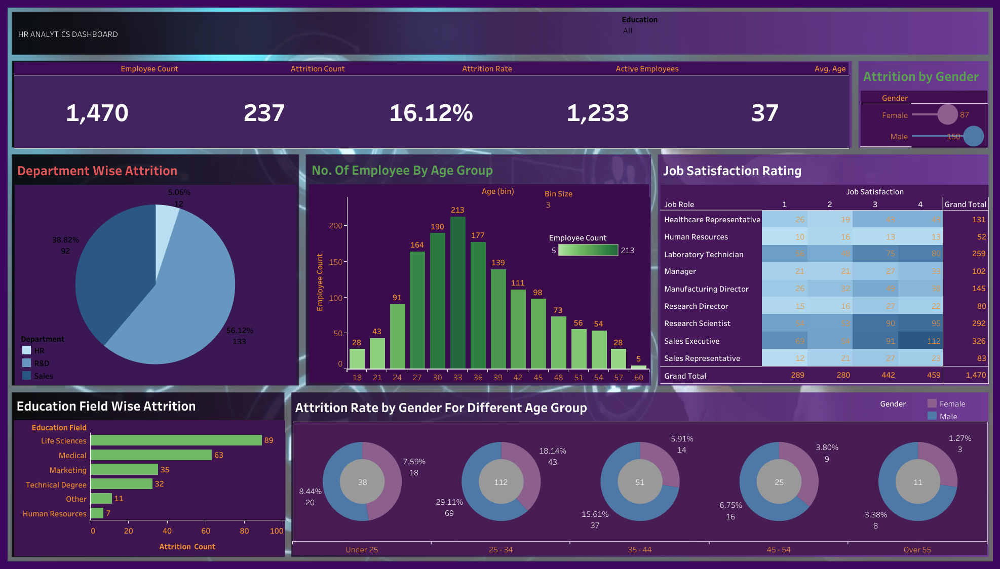

# hr_data_dashboard
HR Data Dashboard is a Tableau project that visualizes employee data to analyze attrition rates, workforce demographics, and job satisfaction trends. It provides interactive insights by department, gender, age group, and education field to support data-driven HR decisions.

# HR Data Dashboard 📊

## 📌 Overview
This project is an **HR Analytics Dashboard** built using Tableau to visualize employee data, track attrition rates, and analyze key workforce metrics such as age distribution, job satisfaction, department-wise turnover, and more.

## 🔗 Live Interactive Version
You can view the fully interactive dashboard here:  
[**View on Tableau Public**](https://public.tableau.com/app/profile/maryha.sulbhi/viz/HRData_17483552865460/Dashboard1)

## 📷 Preview

## 📂 Files in this Repository
- `HR_Data_Dashboard.twbx` → Tableau packaged workbook (can be opened in Tableau Desktop)
- `hr_dashboard.png` → Static preview image of the dashboard
- `README.md` → This documentation file

## 📊 Key Insights
- **Attrition Rate**: 16.12% overall
- **Highest Attrition by Department**: Sales
- **Gender Distribution**: Male – 56.12%, Female – 38.82%
- **Education Field with Highest Attrition**: Life Sciences
- **Most Common Age Group**: 30–33 years

## 🛠️ Tools Used
- Tableau Public for visualization
- Excel/CSV dataset (HR analytics data)

## 📥 How to Use
1. Download the `.twbx` file.
2. Open it in **Tableau Desktop**.
3. Explore, modify, or republish the dashboard.

---
